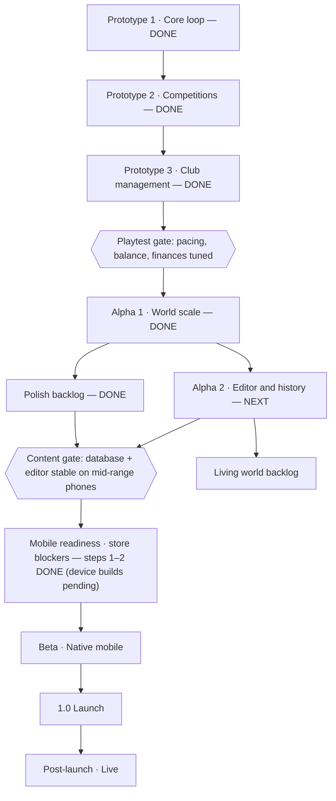

# Touchline — Roadmap

Sep 29, 2026 · Source: [Claude Docs version](https://claude.ai/code/artifact/4208fb1b-f42b-4a90-86c7-46c970e08ba9)

## At a glance

Four prototype builds, Alpha 1, the polish and small-features backlogs and mobile readiness step 2 are done. Alpha 2 (editor and history) is next, then a living-world backlog; device builds and a native store release follow. Phases are ordered but not yet dated.

## Shipped

The web prototype runs on a phone browser with no build step, covering 204 clubs in 20 leagues across 16 nations in three simulation tiers, and 29 national teams. Newest build first.

| Build | What shipped |
| --- | --- |
| Long-term pass | Start unemployed, a real out-of-work state after a sacking (offers come and go while the world plays on), squad safety net, fixes for tournament and save/load bugs found by 4–16-season simulations, leaner long saves (format v6), staff ageing and retirement, rarer wonderkids |
| Small features (moderate) | World News filter chips, managers who move between clubs (poached, rehired or new) with tracked careers, stadium opening years and capacity histories with expansion stories |
| Small features (easy) | Club records and record-breaking news (club, all-time, world transfer), all-time head-to-heads, rivalries that emerge from knockouts and red cards, Player of the Month, injury histories with recurring-problem warnings |
| Small features | Transfer fees on career timelines, captain badge in squad lists and live matches, set-piece goals after the match, in-form and out-of-form players in the digest, team-talk record, last-backup date and season-end backup reminder |
| Mobile readiness 2 | Save migrations (format v5, original kept), saves as real files in the native app, compressed backup export/import, matchday simulation in a Web Worker with progress, autosave when backgrounded, back button / safe areas / keyboard / portrait lock / tablet layout, native haptics, share sheet and status bar, production build and headless regression test, Capacitor 8 Android and iOS projects |
| Alpha 1 polish | Harder polish batch: captain choice (armband boost, Leader effects, morale reactions), pre-match team talk, weekly matchday digest in the feed, penalty / free-kick / corner takers in the match engine. Moderate polish batch: wage and bonus breakdown, negotiation memory, feed read state and Clear read, clean pitch labels, clinched/eliminated group markers. Easy polish batch: restore dismissed reports, compare from report rows, rating-change arrows, stats across all leagues, head-to-head and full fixtures on the team overview, window alerts when skipping. Very easy polish batch: season-preview and haptics toggles, haptic taps, full names and release clauses on scouting rows, opponent's last result on the match card, auto-pick names who it rested, "level on aggregate" extra-time banner. Earlier: match fitness indicators and fitness-aware auto-pick; rating numbers, sort and filters on the squad list; contract-end tags, expiry reminders and no automatic renewals; formation changes keep familiarity; before-kick-off reminders; team overview from any table; Home icon jumps to decisions; dismissable scout reports; compact saves (~3 MB); installable, offline web app (mobile readiness step 1) |
| Alpha 1 · World scale | 12 more leagues in light (Italy, Portugal, Netherlands, Argentina, USA, Japan) and minimal (Mexico, Korea, Thailand, Nigeria, Morocco, Serbia) simulation tiers; Asian, African and North American champions cups and a mid-season Club World Cup; two-legged knockouts and playoff semi-finals with an optional away-goals rule; international qualifying groups, double-header breaks, summer finals as live calendar days, national team jobs; contract clauses (squad status, signing-on fee, appearance and goal bonuses, release clauses, yearly rise, relegation cut) and agent personalities; player talks, promises and player-requested meetings; board meetings, mid-season review and ultimatums; coaching licences; "Next match" skip; world simulation roughly 3× faster |
| Prototype 4 · World expansion | 8 leagues in 5 nations (England 3 tiers, Spain 2, Germany, France, Brazil), domestic cups in every nation, 16-club European cup with quarter-finals, Copa Continental (South America), international football (national teams, Elo ranking, breaks, World and continental championships, caps), fluid match motion, unique player names, fairer board model, finance and development rebalance, IndexedDB saves |
| Prototype 3 · Club management | Staff hire/fire with ability effects, assistant notes and scout picks, season preview with odds and best XI, pre-season friendlies and camps, tactical familiarity, loans in/out, free agents any time, graded scout reports with filters and comparison, fine-grained fee/wage negotiation, realistic nationality mixes (28 nations), post-match shot map, xG race, player stats and analyst insights, sim to half-time, random club at new game |
| Prototype 2 · Competitions | La Primera (Spain, 12 clubs), Crown Cup and Copa Nacional knockouts, Continental Champions Cup (groups + knockouts) with data-driven qualification, cross-border AI market, Transfer Centre |
| Prototype 1 · Core loop | Top-down match engine with highlights and tactical prompts, two-division England with promotion, relegation and playoffs, player traits and personality, word-based scouting, youth intakes, story feed and shareable cards, living world events, Hall of Fame, Football Archive, dark/light theme, 3 save slots |

## Next

The order below is proposed; each phase ends when its gate passes, not on a date.

**Playtest gate (before Alpha 1)**

- [ ] Tune match pacing at 1× and prompt frequency from real play sessions
- [x] Rebalance club finances — done: revenue now tracks reputation, median club roughly breaks even, excess AI cash is reinvested
- [ ] Check difficulty across club identities and both nations
- [x] Fix development inflation (growth now scales with season length) and reputation drift (reverts toward league standing) — done
- [x] Assistant notes clear once acted on or ticked off — done

**Alpha 1 · World scale**

- [x] More leagues using the three simulation tiers (full, light, minimal) — 20 leagues: 8 full, 6 light, 6 minimal
- [x] More continental competitions — Asian, African and North American champions cups and the Club World Cup
- [x] Two-legged knockout ties and away-goals options (world rules at new game)
- [x] National teams, call-ups and international tournaments — qualifiers, summer finals as calendar days and national team jobs
- [x] Contract depth: clauses, bonuses, release fees, agent personalities
- [x] Player interactions and promises; board meetings; coaching licences

**Alpha 2 · Editor and history**

Priority order. Principle: make what the game already has remember what happened, rather than adding screens.

- [ ] Database and world editor — data architecture first (world, clubs, players, staff, competitions, rules, history), then the UI
- [ ] Historical eras from 1992 with era-appropriate rules and tactics
- [ ] Alternate-history setup and scenario creator
- [ ] University draft, high-school graduates, scholarships, overseas trials
- [ ] Player and manager career histories: transfer timelines, biographies, archive stories; managers who move around the world
- [ ] Retired players as owners, pundits and academy coaches
- [ ] Dynamic rivalries that emerge, grow and cool down
- [ ] World News screen with filters
- [ ] Club, manager and player relationships
- [ ] Club, player and world records
- [ ] Deeper economics and different financial models by country
- [ ] Database and scenario export / import (community infrastructure)

**Living world backlog (after Alpha 2; items can be pulled forward)**

- [ ] Football World screen: continents, nations, league coefficients and stats; more nations
- [ ] Club ecosystems: evolving identity, supporters, infrastructure ratings, club history
- [ ] Club philosophy that drives the board, budgets, expectations and job offers
- [ ] Deeper staff with personalities, specialisms and staff politics
- [ ] Tactical evolution driven by successful managers
- [ ] National youth pathways (academies, schools, universities, drafts)
- [ ] Agents as characters with client networks and relationships
- [ ] Media ecosystem: biased papers, podcasts, journalists, unreliable rumours, fan forums
- [ ] Injuries as events: history, recurrence, rehab, surgery, "risk him?" dilemmas
- [ ] Stadium histories: expansions, new stands, moves, renaming

**Polish backlog (alongside Alpha 2)**

Small quality-of-life items, ranked by effort. All four tiers are done.

*Very easy — done*

- [x] Toggle to skip the season-preview popup
- [x] Haptic tap on buttons
- [x] Longer names in report rows (fee moves to the second line)
- [x] Release clause shown on transfer-list rows
- [x] Opponent's last result on the home match card
- [x] Toast after Auto-pick: how many players were rested for fitness
- [x] "Level on aggregate" in the extra-time banner for second legs

*Easy — done*

- [x] Undo a dismissed report ("Dismissed" filter + Restore)
- [x] Compare button on each report row
- [x] Rating-change arrows (▲/▼) on squad rows
- [x] Top scorers across all leagues
- [x] Head-to-head against a club on its team overview (this season)
- [x] Full fixture list on the team overview
- [x] "Next match" skip stops when the transfer window opens or closes

*Moderate — done*

- [x] Wage and bonus spend broken down on the Finances tab
- [x] Negotiation remembers the agent's last demand and shows your progress
- [x] Mark feed items read and "Clear read" (open decisions never cleared)
- [x] Fix crowded pitch labels in 3-5-2 and 5-3-2
- [x] Clinched / eliminated markers in continental groups

*Harder — done*

- [x] Captain choice with morale and Leader effects
- [x] Pre-match team talk
- [x] Weekly digest card summarising each matchday
- [x] Set-piece takers used by the match engine

**Small features backlog — done**

Quick wins, ranked by effort; most are first slices of an Alpha 2 or Living world system.

*Very easy — done*

- [x] Transfer fee on every club spell in the player's career
- [x] Captain's badge on squad rows and in live matches
- [x] Set-piece goals in the post-match summary
- [x] In-form and out-of-form players in the matchday digest
- [x] Team-talk record on the Manager tab
- [x] Last-backup date and a season-end backup reminder

*Easy — done*

- [x] Club records on the Club tab (first slice of Records)
- [x] Record-breaking stories in the feed
- [x] Head-to-head history against each club across seasons
- [x] Rivalry heat and "A new rivalry is emerging" (first slice of dynamic rivalries)
- [x] Player of the month
- [x] Injury history on the player card

*Moderate — done*

- [x] World News filter chips
- [x] Manager movements between clubs, tracked
- [x] Stadium milestones and expansion stories

**Content gate (before Beta)**

- [ ] Large database runs smoothly on mid-range phones; saves stay small

**Mobile readiness · store blockers (1–2 weeks)**

Step 1 is done: the game installs to the home screen and plays offline (web app manifest, service worker, bundled fonts). Step 2 is done in code; the native builds still need a machine with the Android SDK (and a Mac for iOS) to compile and test on devices:

- [x] Save migrations: every format change upgrades old saves instead of refusing them (save format v5; the pre-upgrade save is kept)
- [x] Saves written to real files (Capacitor Filesystem, atomic temp-and-rename) plus compressed export/import backup
- [x] Season simulation in a Web Worker with a progress indicator (main-thread fallback)
- [x] Autosave when the app is backgrounded (live matches pause)
- [x] Phone behaviour: Android/browser back button, safe areas and notch, keyboard, portrait lock on phones / wider tablet layout
- [x] Native plugins: haptics, share sheet for story cards and backups, themed status bar
- [x] Build step (concatenate + esbuild minify, hashed URLs), headless season sim as an automatic regression test (`npm test`)
- [x] Package with Capacitor for iOS and Android (projects generated; not yet compiled)
- [ ] Compile and test on real Android and iOS devices; app icons and splash screens

**Beta · Native mobile (store readiness, 2–4 weeks)**

- [ ] Apple Developer and Google Play accounts; TestFlight / Play internal testing builds
- [ ] Cloud saves (iCloud / Play Games or own server) with a rule for conflicting saves
- [ ] Onboarding and first-time tutorial
- [ ] Accessibility: system text size, screen-reader labels on emoji-only buttons, light-theme contrast
- [ ] Crash reporting (e.g. Sentry); minimal or no analytics
- [ ] Cosmetic stadium themes and retro kits; extra save slots

**1.0 Launch and live**

- [ ] Store release at $9.99–$14.99 with regional pricing
- [ ] DLC, cosmetics and extra save slots through Apple/Google billing (e.g. RevenueCat)
- [ ] Store listing: screenshots, description, age rating, privacy policy
- [ ] Historical database DLC; community sharing of databases, leagues, scenarios and graphics

## Open questions and risks

- **Licensing:** real club, league and player names need a licensing decision; the prototype uses fictional clubs and blocks known real name combinations.
- **Tech stack for release:** proposed answer — keep the web engine inside a native wrapper (Capacitor) rather than porting; the game is plain HTML/CSS/JS with no server.
- **Store updates:** JavaScript updates still normally go through store review, so fixes can't be pushed instantly.
- **Performance at scale:** Alpha 1's 20-league world simulates a matchday in ~0.3 s in the browser, and a compact player format keeps saves at ~3 MB for about 4,400–5,000 players (down from ~5.5 MB). IndexedDB handles that; the 5 MB localStorage fallback (private browsing) is now within reach but tight as worlds grow.
- **Balance:** finances, player development and title dominance by rich clubs need tuning from playtests.
- **Scope:** the editor and history modes are large; they may need to ship after 1.0.
